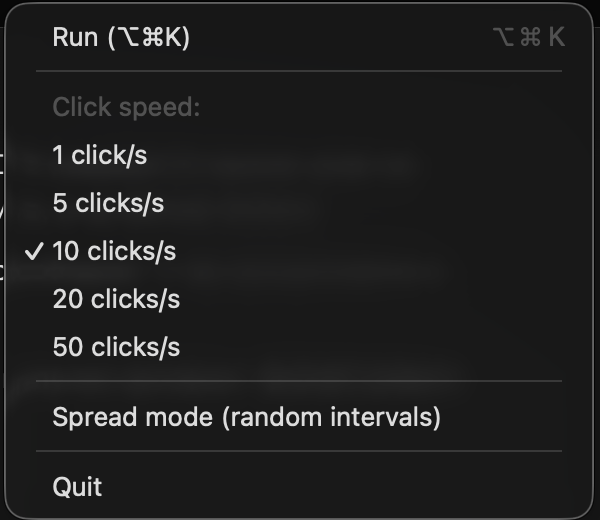

# 🖱️ AutoClicker for macOS

[](https://github.com/Smynay/autoclicker/releases)
[](LICENSE)
[]()
[]()

**macOS menu-bar auto clicker** — pure Swift, zero dependencies. Toggle clicks with a global hotkey anywhere, including fullscreen apps and Chromium browsers.

```
Raw CPS mode 1–50 clicks/s   |   Spread mode (random intervals)
⌥⌘K start/stop              |   Icon lives in the menu bar
```

<p align="center">
  
</p>

## Download (instant, no build needed)

Grab the zip from the latest release, unzip, run `AutoClicker.app`:

**[Download AutoClicker — latest release](https://github.com/Smynay/autoclicker/releases/latest)**

After the first launch, macOS will ask for *Accessibility* permission once — the app will open the correct System Settings pane automatically.

## Features

- **One hotkey ⌥⌘K** toggles auto-clicking anywhere in the system, works in both regular and fullscreen apps
- **Clicks happen at the current cursor position** — park the mouse over the target and go
- **1 / 5 / 10 / 20 / 50 clicks per second** — switchable via the 🖱 menu bar icon
- **Spread mode** — random jitter (0.5×–1.5× of the base interval) between clicks for a human-like cadence
- **Custom clickable-cursor icon** — menu-bar template + cam-included `.icns`, both drawn 100% in code with `AppKit`
- Fully localized in English; lives in the menu bar (`LSUIElement`) and never appears in the Dock

## Requirements

- macOS 12.0+
- Xcode Command Line Tools (`xcode-select --install`)

## Build

```bash
./build.sh
open build/AutoClicker.app
```

The script compiles `src/AutoclickerApp.swift` + `src/IconGen.swift`, generates the status-bar images and the full `.icns` icon set (16×16 … 512×512 @2x), signs the bundle so the Accessibility grant survives rebuilds, and (with `release` mode) drops a zip into `build/dist/`.

## Releases & CI

Tagging a version (`git tag v1.2.0 && git push --tags v1.2.0`) triggers the GitHub Actions pipeline that builds the app on a macOS runner and attaches the zip to the release automatically — no local build needed.

To make CI-signed builds keep their Accessibility grant across updates, define repo secrets (Settings → Secrets):
- `SIGNING_CERT_P12` — base64 of an identity exported as PKCS#12 (see below)
- `SIGNING_CERT_PASSWORD` — its passphrase

Without secrets the CI build falls back to ad-hoc signing. Whether you build locally or in a pipeline, the grant is per *machine*: every new user machine enables the checkbox once — that is normal macOS behavior; the stable identity only protects against re-granting after updates.

### Stable signing (optional but recommended)

The Accessibility grant is bound to the code signature; with ad-hoc signing every rebuild silently invalidates it. To keep the identity stable across rebuilds, generate a self-signed code-signing certificate **once**:

```bash
openssl req -x509 -newkey rsa:4096 -keyout certs/autoclicker-key.pem -out certs/autoclicker-cert.pem \
  -days 3650 -nodes -subj "/CN=AutoClicker Self-Signed/O=AutoClicker/OU=Personal" \
  -addext "keyUsage=digitalSignature,keyEncipherment" -addext "extendedKeyUsage=codeSigning"
openssl pkcs12 -export -out /tmp/ac.p12 -inkey certs/autoclicker-key.pem -in certs/autoclicker-cert.pem -passout pass:ac
security import /tmp/ac.p12 -k ~/Library/Keychains/login.keychain-db -P "ac" -A
```

`build.sh` auto-detects the `AutoClicker Self-Signed` identity in the login keychain and uses it; otherwise falls back to ad-hoc signing.

## First run: grant Accessibility

macOS requires *Accessibility* access for synthetic mouse/keyboard events. On first launch (or **after each rebuild** with ad-hoc signature) AutoClicker opens the right preference pane and shows a dialog:

```
System Settings → Privacy & Security → Accessibility → ✅ AutoClicker
```

The 🖱 menu-bar icon opens the menu with Run/Stop, the speed selector (check marks), the spread toggle and a **Grant Accessibility access…** shortcut that jumps straight to the correct pane.

## Hotkey

| Key | Action |
|---|---|
| `⌥⌘K` | Toggle clicker on/off |

## How it works

| Part | Implementation |
|---|---|
| Scheduling | A single dedicated thread with an absolute-time deadline loop — each tick is scheduled from the previous *target* time, so planner overhead never accumulates |
| Click dispatch | `CGEvent` synthesized events: `mouseMoved` + `leftMouseDown` + 30ms-delayed `leftMouseUp`, posted via `.cghidEventTap` with the `.hidSystemState` source (works through fullscreen apps and Chromium) |
| Hotkey | Carbon `RegisterEventHotKey`, no extra accessibility request |
| Menu bar | `NSStatusItem` + `NSMenuDelegate`, 18pt template image, programmatically drawn cursor icon |
| Coordinates | Cursor location rounded to a whole pixel — macOS fractional coords made the cursor drift over the place with time otherwise |
| Packaging | `build.sh` assembles the `.app` bundle by hand: executable, `Info.plist` with `LSUIElement`, iconset → `icns`, ad-hoc code signature |

## Engine quirks we discovered the hard way (read this if you fork it)

- macOS silently blows away non-signed synthetic clicks — always codesign the app (our `build.sh` verifies and refuses to publish a broken bundle, `codesign --verify --strict`).
- Chromium ignores repeated mouse-downs at the *same* integer position unless there's a `mouseMoved` immediately before it.
- The up/down events must share the *exact* `mouseEventClickState` value to be treated as a single click by Chromium.
- Accessibility permission is cached per *code signature* — an ad-hoc rebuild changes the signature and the permission disappears with no warning.

## File map

```
src/AutoclickerApp.swift    main app: menu-bar, hotkey, click engine
src/IconGen.swift           vector icon generator (menu-bar + .icns pipeline)
build.sh                    full build pipeline → build/AutoClicker.app
test/counter.html           local click counter for manual CPS measurement
test/mousectl.swift         CLI helper to simulate mouse moves/clicks and ⌥⌘K
test/atomic.mjs             Playwright-based end-to-end verification harness
```

## License

MIT — see [LICENSE](LICENSE).
